<!-- Slide 1: Cover Slide - Introduction Git & GitHub -->
#  INTRODUCTION TO GIT & GITHUB
## Git, GitHub

    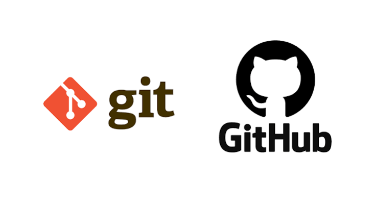

---

<!-- Slide 2: Khóa Học OVERVIEW -->
#  TỔNG QUAN 5 BUỔI HỌC
## Lộ trình cho học PNV28

  <h3>Buổi 1: Giới thiệu Git, Khái niệm cơ bản, Init / Add / Commit / Log</h3>
  
Làm quen Git, cài đặt, tạo account GitHub, hiểu 3 vùng dữ liệu & lệnh Terminal đầu tiên.

  <h3>Buổi 2: Git Branching, Merge & Conflict Resolution</h3>
  
Tạo nhánh độc lập, gộp code và kỹ thuật tự tay xử lý đụng độ code thủ công.

  <h3>Buổi 3: GitHub Remote - Push / Pull / Clone & Pull Requests</h3>
  
Đưa dự án lên đám mây, đồng bộ dữ liệu và quy trình duyệt code (PR) chuẩn team.

  <h3>Buổi 4: Workflow Thực Tế (Git Flow, Feature Branch) & Teamwork</h3>
  
Mô hình Git Flow chuẩn doanh nghiệp, làm việc nhóm an toàn với GitHub.

  <h3>Buổi 5: Quản Lý Dự Án Jira & Liên Kết GitHub</h3>
  
Tạo Project/Board trên Jira, theo dõi công việc và tự động hóa trạng thái với Git.

---

<!-- Slide 3: BUỔI 1 OVERVIEW -->
#  BUỔI 1: OVERVIEW NỘI DUNG HỌC
## Cài Đặt, Khái Niệm Cơ Bản & Câu Lệnh Terminal Khởi Đầu

  

    

      <h3>Các Nội Dung Chính</h3>
      
1. Hiểu nhanh Git là gì & phân biệt Git vs GitHub / SourceTree.

      
2. Cài đặt Git & Đăng ký tài khoản GitHub.

      
3. Nắm vững 3 Vùng Dữ Liệu Trong Git.

      
4. Các câu lệnh Terminal căn bản: <code>init</code>, <code>status</code>, <code>add</code>, <code>commit</code>, <code>log</code>.

    

  

  

    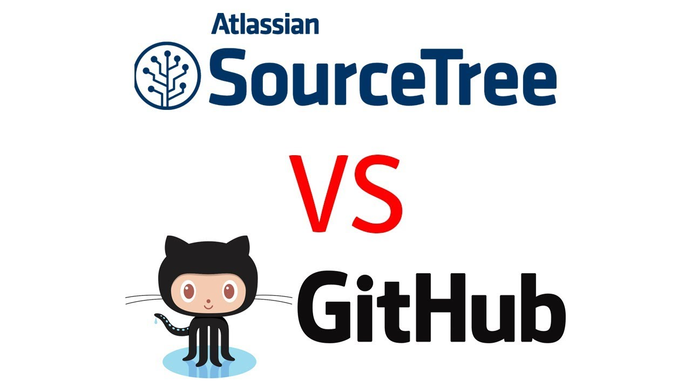
  

---

<!-- Slide 4: Buổi 1 - Giới Thiệu Git Ngắn Gọn -->
#  Buổi 1: Git Là Gì & Tại Sao Lại Dùng Git?
## Giới thiệu cực kỳ dễ hiểu dành cho người mới

  

    

      <h3>Git Là Gì? (Nhật Ký Lưu Bản Vẽ)</h3>
      
Giống như nút <b>"Save / Undo"</b> thông minh. Giúp bạn lưu lại từng mốc thời gian của file code để quay lại bất kỳ lúc nào nếu lỡ làm hỏng.

    

    

      <h3>Mục Đích Sử Dụng</h3>
      
• Tránh việc phải lưu file thủ công: <code>Code_v1.zip</code>, <code>Code_Final.zip</code>.

      
• Cho phép 10 người cùng sửa 1 dự án mà không lo đè mất code của nhau.

    

  

  

    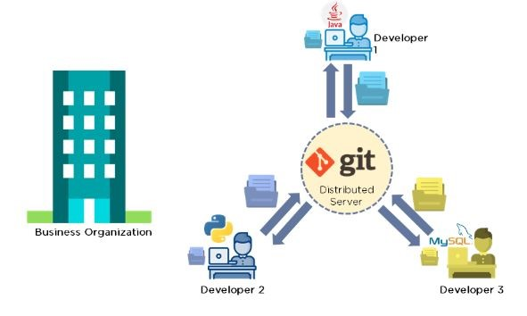
  

---

<!-- Slide 5: Buổi 1 - Phân Biệt Tool -->
#  Buổi 1: Phân Biệt Git, GitHub & SourceTree
## Đừng nhầm lẫn giữa engine, server đám mây và giao diện đồ họa!

  

    <h3>1. Git (Động cơ)</h3>
    
Phần mềm chạy dòng lệnh cài trên máy bạn để lưu lịch sử code local.

  

  

    <h3>2. GitHub / Bitbucket</h3>
    
Website lưu trữ kho chứa code lên đám mây để chia sẻ cho cả team.

  

  

    <h3>3. SourceTree / Client</h3>
    
Phần mềm giao diện đồ họa (nút bấm) giúp thao tác Git không cần gõ lệnh.

  

  

    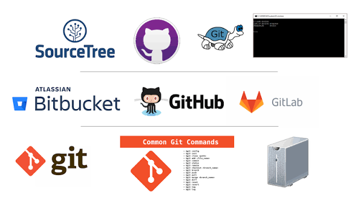
  

  

    

      <h3>Mini Practice 1.1</h3>
      
<b>Câu hỏi nhanh:</b> Bạn A dùng VS Code sửa file, bấm nút <i>Commit</i> rồi đẩy lên <i>GitHub</i>. Trong luồng này, đâu là Git và đâu là GitHub?

    

  

---

<!-- Slide 6: Buổi 1 - Cài Đặt Git Step-by-Step -->
#  Buổi 1: Cài Đặt Git Cho Windows & Mac
## Hướng dẫn từng bước tải và cài đặt phần mềm

  

    <h3>Các Bước Thực Hiện:</h3>
    
<b>1. Tải bộ cài:</b> Truy cập https://git-scm.com/downloads chọn installer phù hợp.

    
<b>2. Cài đặt:</b> Giữ nguyên cài đặt mặc định (Default). Tích chọn <b>Git Bash</b> trên Windows.

    
<b>3. Kiểm tra:</b> Mở Terminal / Git Bash gõ lệnh test:

    <pre><code>git --version</code></pre>
  

  

    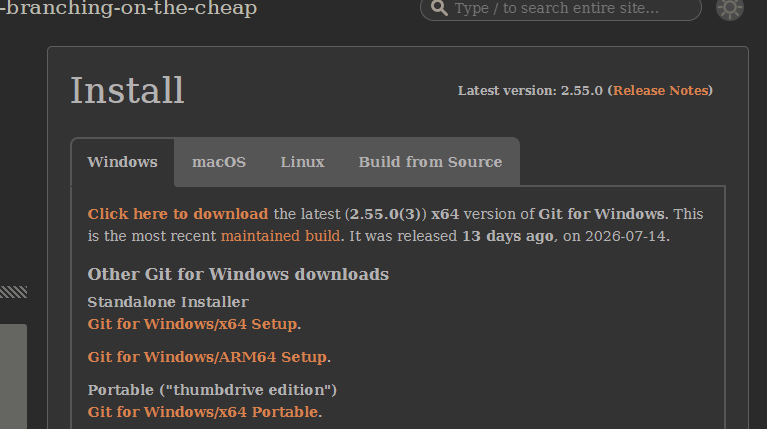
  

---

<!-- Slide 7: Buổi 1 - Git Config & GitHub Register -->
#  Buổi 1: Thiết Lập Identity & Account GitHub
## Khởi tạo thông tin người dùng local và tài khoản web

  

    <h3>1. Thao Tác Terminal (Config Email/Name)</h3>
    <pre><code>git config --global user.name "Nguyen Van A"
git config --global user.email "a.nguyen@gmail.com"
git config --list</code></pre>
    
<i>Email config trùng 100% với Email đăng ký GitHub!</i>

  

    

        <h3>2. Đăng Ký GitHub Web</h3>
        
Truy cập https://github.com &rarr; bấm <b>Sign Up</b> &rarr; Điền Email, Pass, Username &rarr; Xác minh OTP qua mail.

    

  <h3>Mini Practice 1.2: Thực Hành Cài Đặt & Cấu Hình</h3>
  
1. Chạy lệnh <code>git config --list</code> trên máy cá nhân và chụp lại màn hình tên/email đã đặt.

  
2. Đăng ký thành công 1 tài khoản GitHub cá nhân.

---

<!-- Slide 8: Buổi 1 - 3 Vùng Dữ Liệu Trong Git -->
#  Buổi 1: 3 Vùng Dữ Liệu Trong Git
## Cực kỳ dễ hiểu qua mô hình Đi Siêu Thị

  

    

      <h3>1. Working Directory</h3>
      
Nơi viết code trực tiếp trên VS Code (Giống hàng hóa nằm trên kệ siêu thị).

    

    

      <h3>2. Staging Area (Khu vực chờ)</h3>
      
Dùng lệnh <code>git add .</code> để chọn file (Giống nhặt đồ bỏ vào <b>Giỏ Hàng</b>).

    

    

      <h3>3. Local Repository (Kho lưu trữ)</h3>
      
Dùng <code>git commit</code> để đóng gói vĩnh viễn (Giống tính tiền nhận <b>Hóa Đơn</b>).

    

  

  

    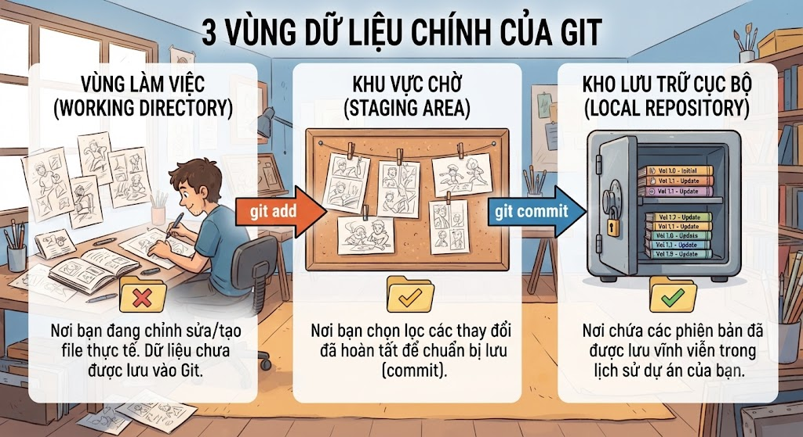
  

---

<!-- Slide 9: Buổi 1 - Câu Lệnh Terminal Căn Bản -->
#  Buổi 1: Thao Tác Dòng Lệnh Git Căn Bản
## Các lệnh làm việc local chạy hàng ngày

  

    
<code>git init</code> : Biến 1 thư mục thường thành kho chứa Git.

    
<code>git status</code> : Kiểm tra trạng thái các file (đã sửa / chưa add).

    
<code>git add .</code> : Đưa file vào Staging Area (Giỏ hàng).

    
<code>git commit -m "Mô tả"</code> : Chốt phiên bản kèm lời nhắn.

    
<code>git log --oneline</code> : Xem lại lịch sử các commit.

  

  

    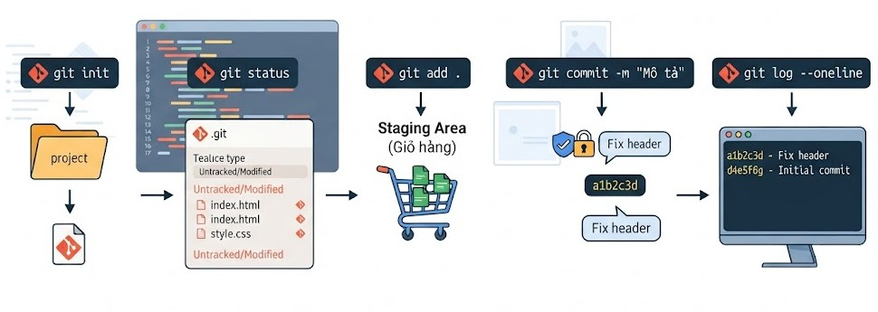
  

  <h3>Mini Practice 1.3: Bài Tập Commit Đầu Tiên</h3>
  
Tạo thư mục <code>my-project</code> &rarr; Chạy <code>git init</code> &rarr; Tạo file <code>index.html</code> &rarr; Chạy <code>git add .</code> &rarr; Commit với tin nhắn <i>"Init project"</i> &rarr; Kiểm tra lại bằng <code>git log</code>.

---

<!-- Slide 10: BUỔI 2 OVERVIEW -->
#  BUỔI 2: OVERVIEW NỘI DUNG HỌC
## Git Branching, Merge & Conflict Resolution

  

    

      <h3>Các Nội Dung Chính</h3>
      
1. Khái niệm nhánh (Branch) và tại sao phải chia nhánh?

      
2. Các lệnh thao tác nhánh: <code>branch</code>, <code>checkout</code>, <code>checkout -b</code>.

      
3. Gộp nhánh (Merge code) về nhánh chính <code>main</code>.

      
4. Nhận diện và tự tay giải quyết Merge Conflict thủ công.

    

  

  

    
  

---

<!-- Slide 11: Buổi 2 - Quản Lý Nhánh (Branch) -->
#  Buổi 2: Kỹ Thuật Chia Nhánh (Branching)
## Giúp bạn làm tính năng mới cực kỳ an toàn

  

    <h3>Lệnh Thao Tác Nhánh:</h3>
    
• Xem danh sách nhánh: <code>git branch</code>

    
• Tạo nhánh mới: <code>git branch feature/login</code>

    
• Chuyển sang nhánh mới: <code>git checkout feature/login</code>

    
• Tạo & chuyển nhanh: <code>git checkout -b feature/login</code>

  

  

    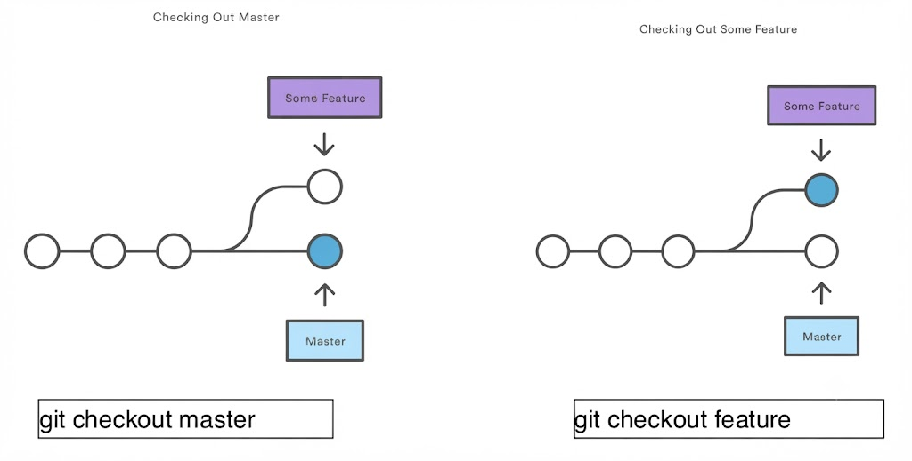
  

  <h3>Mini Practice 2.1</h3>
  
Tại dự án <code>my-project</code>, tạo nhánh mới tên <code>feature/header</code>, chuyển sang nhánh đó, tạo file <code>header.html</code> rồi thực hiện commit.

---

<!-- Slide 12: Buổi 2 - Gộp Nhánh (Merge) & Conflict -->
#  Buổi 2: Quy Trình Merge & Fix Conflict
## Cách xử lý đụng độ code khi làm việc chung file

  

    <h3>1. Gộp Nhánh (Merge)</h3>
    <pre><code>git checkout main
git merge feature/login</code></pre>
    <h3>2. 4 Bước Fix Conflict Thủ Công</h3>
    
<b>B1:</b> Mở file lỗi trên VS Code tìm vạch <code><<<<<<< HEAD</code>.

    
<b>B2:</b> Thảo luận với bạn cùng team để chọn đoạn code đúng.

    
<b>B3:</b> Xóa vạch ký hiệu, chạy <code>git add .</code>

    
<b>B4:</b> Chốt commit: <code>git commit -m "Fix conflict"</code>

  

  

    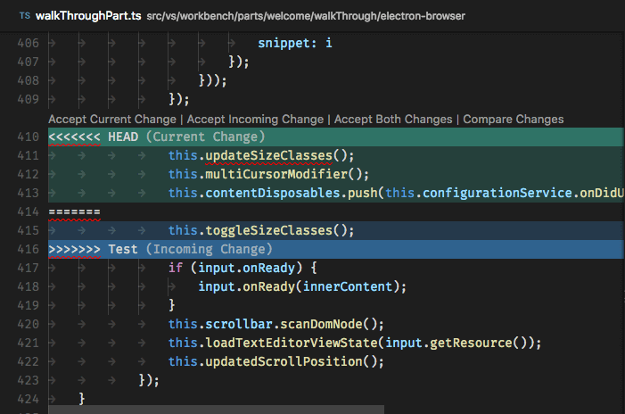
  

  <h3>Mini Practice 2.2: Thử Tạo & Sửa Conflict</h3>
  
Tạo 2 nhánh cùng sửa dòng 1 file <code>README.md</code>. Tiến hành Merge nhánh 2 vào nhánh 1 để kích hoạt conflict, sau đó dùng VS Code sửa và commit lại!

---

<!-- Slide 13: BUỔI 3 OVERVIEW -->
#  BUỔI 3: OVERVIEW NỘI DUNG HỌC
## GitHub Remote Repository & Quy Trình Pull Request (PR)

  

    

      <h3>Các Nội Dung Chính</h3>
      
1. Kết nối Git Local với Remote Repo trên GitHub Web.

      
2. Thành thạo 3 lệnh đồng bộ: <code>clone</code>, <code>push</code>, <code>pull</code>.

      
3. Quy trình gửi Pull Request (PR) để xin gộp code.

      
4. Cách phân công Assignee, chỉ định Reviewer và Comment duyệt code.

    

  

  

    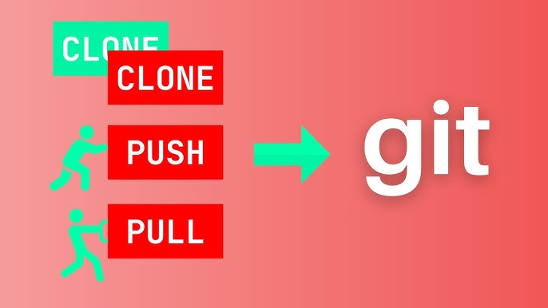
  

---

<!-- Slide 14: Buổi 3 - Các Lệnh Đám Mây -->
#  Buổi 3: Kết Nối GitHub Remote (Clone/Push/Pull)
## Đưa project từ máy cá nhân lên server đám mây

  

    <h3>1. Liên Kết Remote Repo</h3>
    <pre><code>git remote add origin <URL-GitHub></code></pre>
    <h3>2. 3 Lệnh Thao Tác Chính</h3>
    
• <code>git clone <URL></code> : Tải toàn bộ Repo từ GitHub về máy mới.

    
• <code>git push origin <branch></code> : Đẩy commit từ máy lên GitHub.

    
• <code>git pull origin <branch></code> : Tải code mới nhất từ GitHub về máy.

  

  

    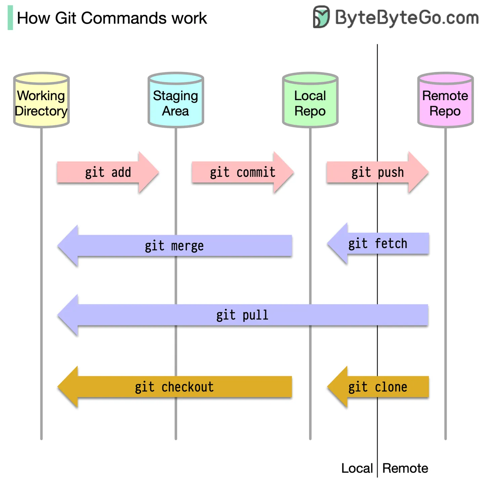
  

  <h3>Mini Practice 3.1</h3>
  
Tạo Repo mới trên GitHub web &rarr; Liên kết với project dưới máy qua <code>git remote add origin</code> &rarr; Push nhánh <code>main</code> lên GitHub.

---

<!-- Slide 15: Buổi 3 - Quy Trình Pull Request (PR) -->
#  Buổi 3: Quy Trình Mở & Duyệt Pull Request (PR)
## Quy chuẩn kiểm tra chất lượng code trước khi gộp nhánh main

  

    <h3>Các Bước Thực Hiện PR Chuyên Nghiệp:</h3>
    
<b>1. Push nhánh:</b> <code>git push origin feature/user-profile</code>

    
<b>2. Mở PR:</b> Vào GitHub bấm <b>Compare & pull request</b>.

    
<b>3. Description:</b> Nhập mô tả công việc đã hoàn thành.

    
<b>4. Gán người:</b> Chọn bản thân ở <b>Assignees</b>, chọn Leader ở <b>Reviewers</b>.

    
<b>5. Review & Merge:</b> Leader xem Diff, Comment, Approve &rarr; Bấm <b>Merge Pull Request</b>.

  

  

    
  

  <h3>Mini Practice 3.2: Bài Tập Làm Việc Cặp</h3>
  
Học viên A tạo nhánh feature, push lên GitHub và mở PR &rarr; Gán Học viên B làm Reviewer &rarr; Học viên B vào comment check code và bấm Approve &rarr; Tiến hành Merge PR.

---

<!-- Slide 16: BUỔI 4 OVERVIEW -->
#  BUỔI 4: OVERVIEW NỘI DUNG HỌC
## Workflow Thực Tế (Git Flow) & Làm Việc Nhóm

  

    

      <h3>Các Nội Dung Chính</h3>
      
1. Tại sao dự án thực tế cần mô hình chuẩn (Workflow)?

      
2. Chi tiết Mô hình nhánh Git Flow (Master, Develop, Feature, Hotfix).

      
3. Quy tắc phối hợp làm việc nhóm an toàn trên GitHub.

      
4. Các VS Code Extension hỗ trợ dùng Git tốt hơn (GitLens, Git Graph).

    

  

  

    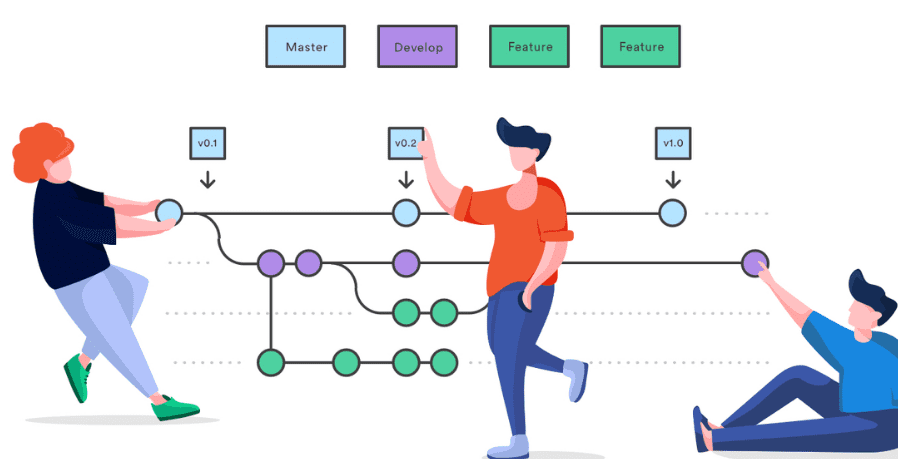
  

---

<!-- Slide 17: Buổi 4 - Mô Hình Git Flow -->
#  Buổi 4: Mô Hình Git Flow Trong Doanh Nghiệp
## Phân loại chức năng từng nhánh trong dự án thực tế

  

    <h3>Phân Loại Nhánh Chuẩn:</h3>
    <ul>
      <li>Main / Master: Code chạy trực tiếp cho khách hàng (Production-ready).</li>
      <li>Develop: Nơi chứa code mới nhất đang thử nghiệm.</li>
      <li><b>Feature Branches:</b> Nhánh làm tính năng riêng (VD: <code>feature/login</code>).</li>
      <li><b>Hotfix Branches:</b> Nhánh vá lỗi gấp trực tiếp trên <code>main</code>.</li>
    </ul>
  

  

    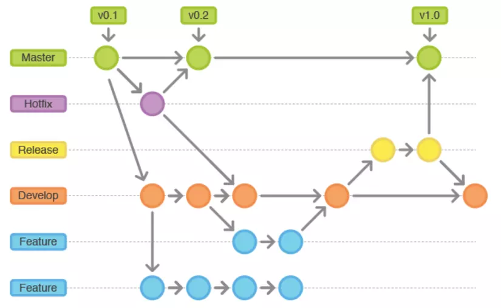
  

  <h3>Mini Practice 4.1</h3>
  
Cả nhóm thống nhất tạo nhánh <code>develop</code> từ <code>main</code>. Mỗi thành viên rẽ nhánh <code>feature/ten-minh</code> từ <code>develop</code> để làm bài tập, sau đó mở PR gộp lại vào <code>develop</code>.

---

<!-- Slide 18: Buổi 4 - Extensions Hỗ Trợ Git -->
#  Buổi 4: Các Extension Hỗ Trợ Git Trên VS Code
## Tăng tốc độ làm việc và soi lịch sử code trực quan

  

    <h3>1. GitLens</h3>
    
Hiển thị trực tiếp ai là người viết từng dòng code (Git Blame) và lịch sử chỉnh sửa theo thời gian thực.

    <h3>2. Git Graph</h3>
    
Vẽ sơ đồ cây các nhánh, các điểm Commit & Merge bằng giao diện hình ảnh đẹp mắt, dễ thao tác.

  

  

    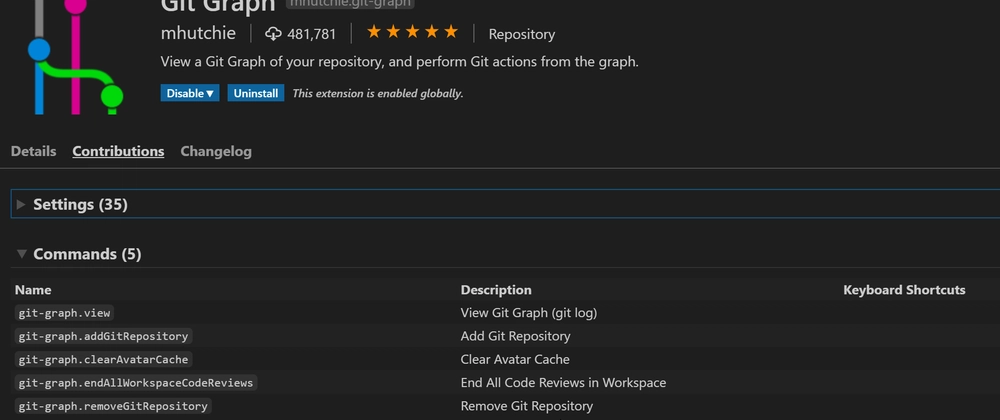
    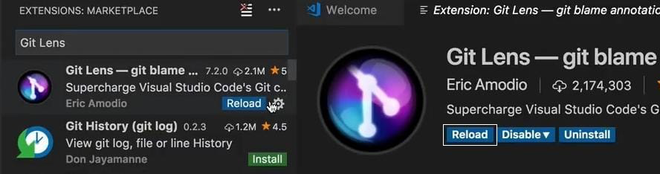
  

---

<!-- Slide 19: BUỔI 5 OVERVIEW -->
#  BUỔI 5: OVERVIEW NỘI DUNG HỌC
## Quản Lý Dự Án Jira & Liên Kết Tự Động Với GitHub

  

    

      <h3>Các Nội Dung Chính</h3>
      
1. Giới thiệu các Tool quản lý công việc: Jira, Trello & GitHub Projects.

      
2. Khởi tạo Project & thiết lập Board (Kanban/Scrum) trên Jira.

      
3. Quản lý các loại Issue (Epic, Story, Task, Bug).

      
4. Tự động hóa liên kết Task ID Jira với Git Commit & Pull Request.

    

  

  

    
  

---

<!-- Slide 20: Buổi 5 - Jira Project & Task Types -->
#  Buổi 5: Tạo Project & Quản Lý Task Trên Jira
## Theo dõi tiến độ dự án chuyên nghiệp

  

    <h3>1. Các Cột Căn Bản Trên Board:</h3>
    
• <b>To Do</b> &rarr; <b>In Progress</b> &rarr; <b>Code Review</b> &rarr; <b>Done</b>.

    <h3>2. Phân Loại Issue TRên Jira:</h3>
    
• <b>Epic:</b> Tính năng lớn dự án.

    
• <b>Story / Task:</b> Yêu cầu công việc cụ thể (có Mã ID: <code>ECOMM-101</code>).

    
• <b>Bug:</b> Lỗi phát sinh cần sửa.

  

  

    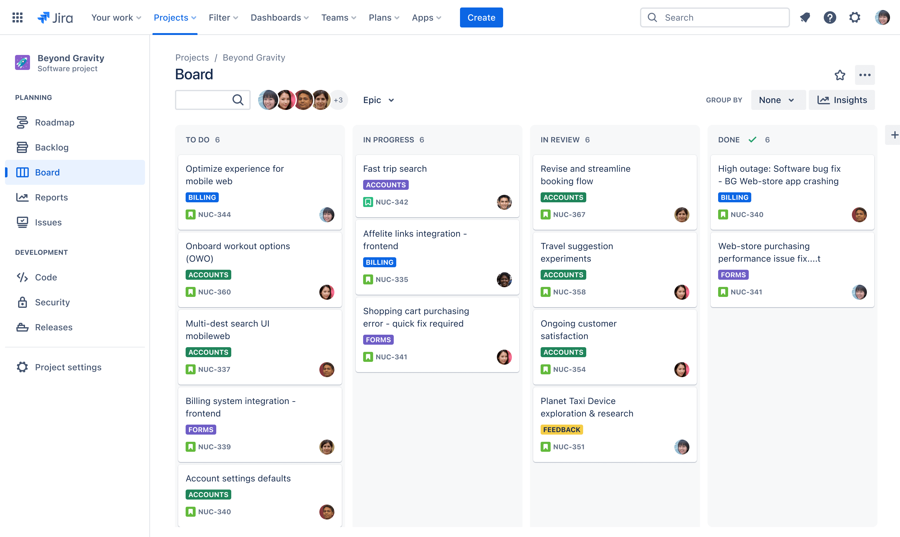
  

  <h3>Mini Practice 5.1</h3>
  
Đăng nhập Jira, tạo 1 Software Project mẫu, tạo 2 Task trong cột <b>To Do</b> và gán Assignee cho bản thân.

---

<!-- Slide 21: Buổi 5 - Hướng Dẫn Kết Nối Jira Với GitHub (CÀI ĐẶT INTEGRATION) -->
#  Buổi 5: Hướng Dẫn Tích Hợp Jira Với GitHub
## Các bước thiết lập liên kết hai nền tảng

  

    <h3>4 Bước Kết Nối Hệ Thống:</h3>
    
<b>Bước 1:</b> Vào Jira &rarr; Chọn <b>Apps</b> &rarr; Tìm app <b>GitHub for Jira</b> và bấm <i>Get it now</i>.

    
<b>Bước 2:</b> Đăng nhập tài khoản GitHub &rarr; Ủy quyền cấp phép (Authorize Atlassian).

    
<b>Bước 3:</b> Chọn Organization / Repository trên GitHub muốn kết nối với Jira Project.

    
<b>Bước 4:</b> Kiểm tra mục <b>Development</b> hiển thị trong giao diện chi tiết Task của Jira.

  

  

    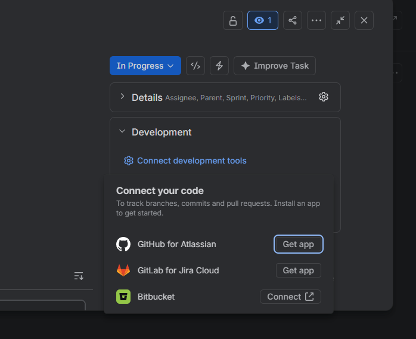
  

---

<!-- Slide 22: Buổi 5 - Tự Động Hóa Jira + GitHub -->
#  Buổi 5: Quy Trình Tự Động Hóa Jira + GitHub
## Chỉ cần gắn Mã Task ID, Jira sẽ tự động cập nhật!

  <h3>Luồng Tích Hợp Đã Tối Ưu Hóa</h3>
  <table>
    <tr>
      <th>Giai Đoạn</th>
      <th>Thao Tác Jira</th>
      <th>Thao Tác Dưới Git / GitHub</th>
    </tr>
    <tr>
      <td>1. Nhận Task</td>
      <td>Lấy mã Task ID (VD: <code>ECOMM-101</code>)</td>
      <td><code>git checkout -b feature/ECOMM-101-login</code></td>
    </tr>
    <tr>
      <td>2. Viết Code</td>
      <td>Chuyển Task sang <b>In Progress</b></td>
      <td><code>git commit -m "ECOMM-101 Add validation"</code></td>
    </tr>
    <tr>
      <td>3. Code Review</td>
      <td>Jira tự động gắn link PR vào Task</td>
      <td>Push nhánh & Tạo PR chỉ định Reviewer</td>
    </tr>
    <tr>
      <td>4. Hoàn Thành</td>
      <td>Task tự động chuyển sang <b>Done</b></td>
      <td>Merge Pull Request vào nhánh chính</td>
    </tr>
  </table>

---
#  Buổi 5: Quy Trình Tự Động Hóa Jira + GitHub
## Chỉ cần gắn Mã Task ID, Jira sẽ tự động cập nhật!

  

    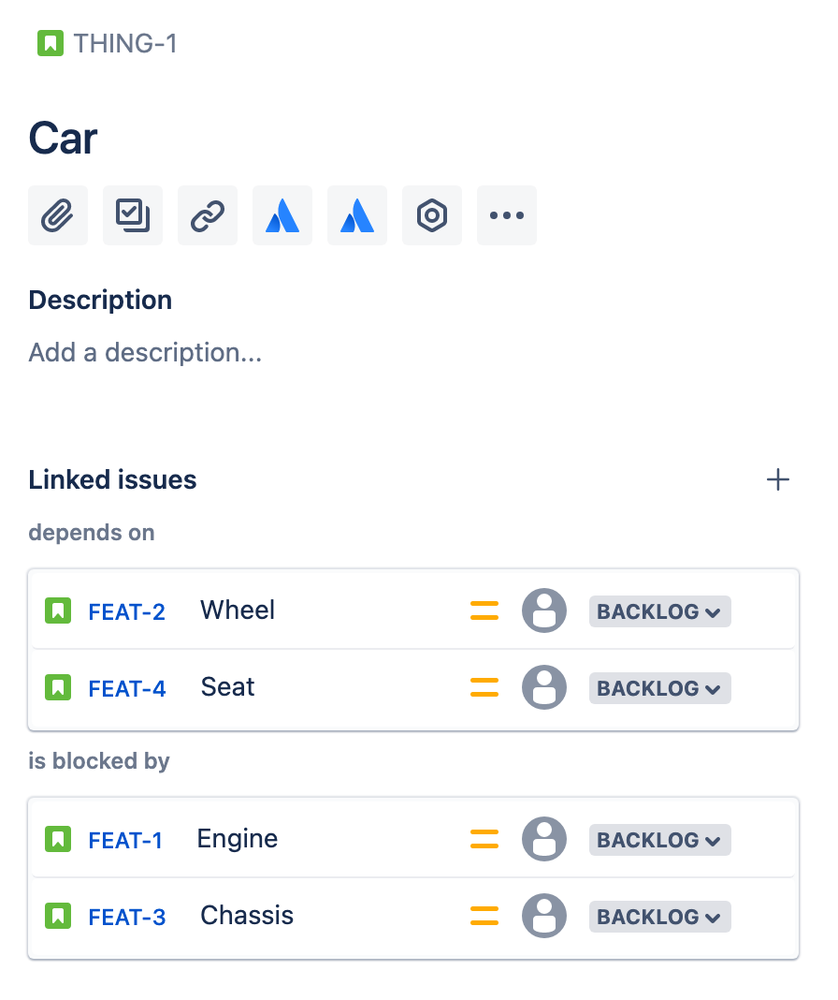
  

  

    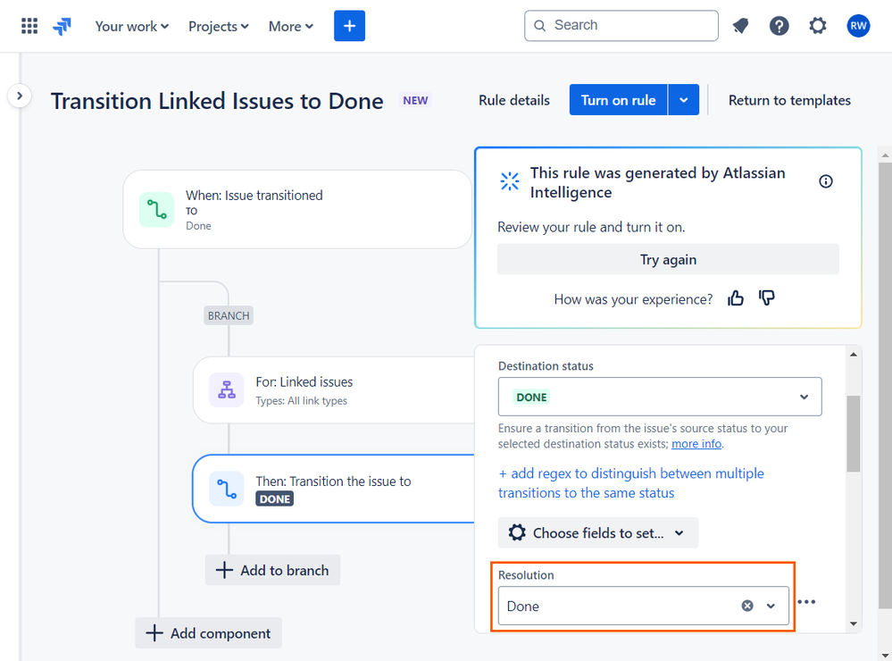
  

  

---

<!-- Slide 23: Tổng Kết Khóa Đào Tạo -->
#  TỔNG KẾT KHÓA ĐÀO TẠO
## Đây là phần câu hỏi

  

